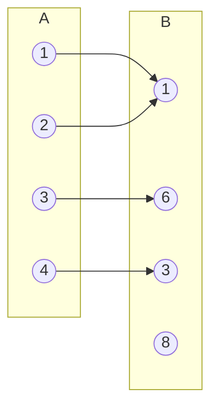
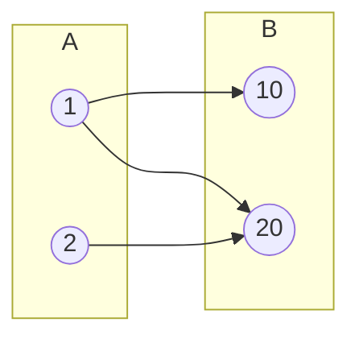
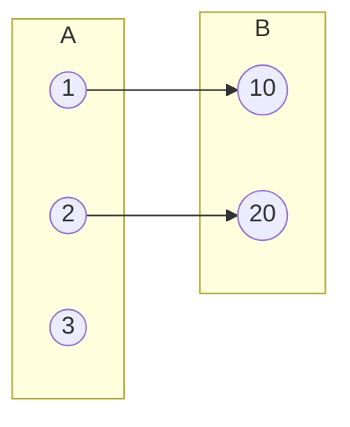

Data: 

**Assunto:** Definição de Função e Condições de Existência

---
## 1. O que é uma Função? (Diagrama de Venn)

Para que uma relação entre um conjunto $A$ (Domínio) e um conjunto $B$ (Contradomínio) seja uma função, é necessário respeitar as seguintes regras:

1. **Totalidade:** Todos os elementos do conjunto $A$ devem ter uma imagem em $B$.
    
2. **Unicidade:** Cada elemento de $A$ só pode ter **uma e uma única** imagem em $B$.

> [!danger] Um elemento de A com duas imagens. No diagrama abaixo, o elemento **1** tenta ligar-se ao **10** e ao **20**.

Fragmento do código

> [!danger] Elemento de A "sozinho". Não é função porque o elemento **3** não tem correspondência em B.

Fragmento do código

---
## 2. Condições de Existência do Domínio ($D_f$)

Quando trabalhamos com uma função temos que **saber o domínio dela**.  Será o **domínio que vai determinar os valores possíveis para a variável**.

Em alguns casos, **em valores não são explícitos então devemos  considerar como domínio o conjunto de todos os números que podem ser colocados no lugar da variável independentemente da forma da função**.

### Tipos de Funções e Suas Restrições

| **Tipo de Função**       | **Exemplo 1**              | **Exemplo 2**    | **Condição / Domínio**                 |
| ------------------------ | -------------------------- | ---------------- | -------------------------------------- |
| **Polinomial**           | $f(x) = x + 3$             | $f(x) = x²+2x+1$ | $D_f = \mathbb{R}$ (Sempre)            |
| **Racional**             | $f(x) = \frac{n(x)}{D(x)}$ |                  | $D(x) \neq 0$ (Denominador não nulo)   |
| **Irracional (n par)**   | $f(x) = \sqrt[2]{g(x)}$    |                  | $g(x) \geq 0$ (Radicando não negativo) |
| **Irracional (n ímpar)** | $f(x) = \sqrt[3]{g(x)}$    |                  | $D_f = \mathbb{R}$                     |

---

## 3. Exercícios de Aplicação

### Exercício 1: Função com Raiz

Determine o domínio da função:

a) $g(x) = (2x - 5)²$

	$Dg(x) = \{ x \in \mathbb{R} \} \qquad D(x) = \mathbb{R}$

b) $f(x) =  \sqrt{(3x+5)}-8$

	$3x + \ge 0$
	$x \ge \frac 33$
	
> [!tip] Nota
> Só se faz o que esta dentro dos parenteces

c) $g(x) = \frac{9x-8}{x+1}$

	$x + 1 \neq 0$
	$x \neq -1$

	$Dg(x) = \{ x \in \mathbb{R}\quad|\quad D(x) \neq 0 \}$
	$Dg(x) = \{ x \in \mathbb{R}\quad|\quad D(x) \neq -1 \}$

d) $f(x) = x²-9$

	$Df(x) = \{ x \in \mathbb{R} \}$

e) $h(t) = \sqrt{9t-26}-5$

	$9t -26 \geq 0$
	$9t \geq 26$
	$t \geq \frac{26}{9}$
	$Dh = \mathbb{R}\{ \frac{26}{9} \}$

f) $f(x) = \frac{3-2x}{9-4x}$

	$9 - 4x \neq 0$
	$-4 \neq -9$
	$x \neq \frac94$
	
	$Df = \{ x \in \mathbb{R} | x \neq \frac94 \}$

g) $f(x) = 1 - 3³$

	$Df(x) = \{ x \in \mathbb{R} \} \quad \text{ou}\quad D=\mathbb{R}$

h) $f(x) = \frac1x + 5$

	$Df = \{ x \in \mathbb{R} | x \neq 0 \}$

i) $f(x) = \frac{-x}{x²+x}$

	$x²+X \neq 0$
	$x(x+1) \neq 0$
	$x\neq 0 \quad \text{e}\quad  x \neq -1$

	$Df(x) = x \in \mathbb{R} \quad|\quad x \neq 0 \quad \land \quad x \neq -1$

j) $n(x) = \frac{\sqrt{-x-3}}{\sqrt[3]{x-2}}$

	$x-2 \neq 0 \qquad\qquad -x+3 \geq 0$
	$x \neq +2 \qquad\qquad\quad -x \geq 0 -3 \Leftarrow \quad \text{multiplica-se por (-1) para mudar o sinal para positivo}$ 
	$\qquad\qquad\qquad\qquad\quad x \leq 3$
	$Dn(x) = \{ x \in \mathbb{R} \quad | \quad x \leq 3 \quad \text{e} \quad x \gt 2 \}$

l) $n(x) = \frac{\sqrt{-x+3}}{\sqrt{x-2}}$

	$-x + 3 \geq 0$
	$-x \geq -3 \leftarrow (-1)$ 
	$x \leq 3$

	$x-2 \geq 0$
	$x \gt 2$

	$Dn(x) = \{ x \in \mathbb{R} \quad | \quad x \geq 3 \quad \text{e} \quad x \gt 2 \}$

---

> [!tip] Nota de Estudo
> 
> Lembra-te que em equações, se multiplicares ou dividires por um número negativo, o sinal da desigualdade inverte.
> 
> Exemplo: $-x \geq -3 \implies x \leq 3$.

