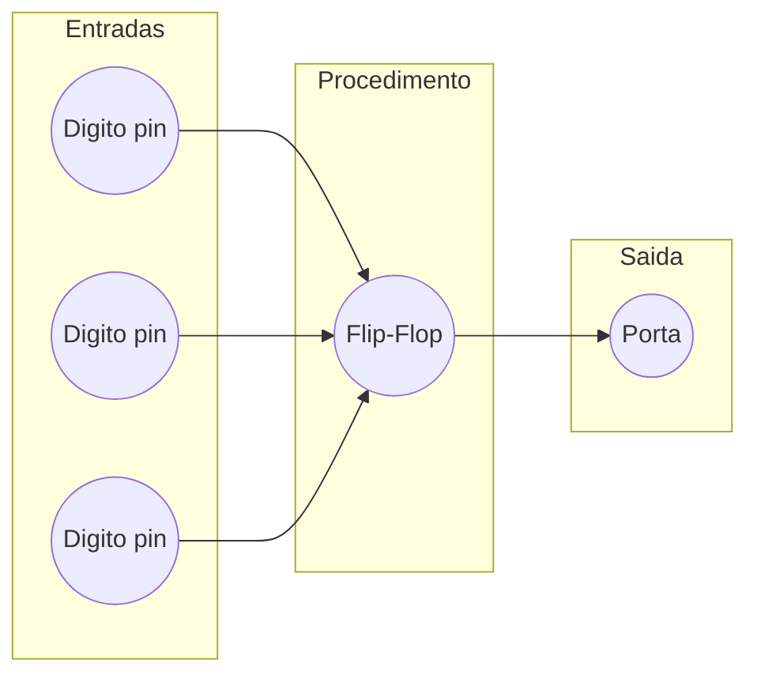

# Simulacao de Teste — Introducao a Sistemas Digitais (ISD)

> [!info] Informacao
> **Disciplina:** Introducao a Sistemas Digitais (ISD)
> **Data:** 2026-02-11
> **Conteudo:** Conversao de bases, resistencias e codigo de cores, LEDs, portas logicas, algebra booleana, mapas de Karnaugh, MUX/DEMUX, circuitos integrados TTL (74LS), flip-flops (D e JK), maquinas de estado (Moore e Mealy), contadores, registos de deslocamento, displays de 7 segmentos
> **Tipo:** Simulacao de Teste

---

## Parte I — Escolha Multipla

**1.** Qual das seguintes afirmacoes descreve corretamente o funcionamento de um multiplexer (MUX) 8:1?

- [ ] a) Recebe 1 entrada e distribui para 8 saidas, controlado por 3 bits de selecao
- [x] b) Recebe 8 entradas e seleciona 1 saida, controlado por 3 bits de selecao
- [ ] c) Recebe 8 entradas e seleciona 1 saida, controlado por 8 bits de selecao
- [ ] d) Recebe 3 entradas e seleciona 1 saida, controlado por 8 bits de selecao

**2.** Num flip-flop JK, quando $J=1$ e $K=1$, qual e o comportamento da saida $Q$ no flanco ativo do clock?

- [ ] a) $Q = 0$ (Reset)
- [ ] b) $Q = 1$ (Set)
- [x] c) $Q$ mantem o estado anterior (Hold)
- [ ] d) $Q$ inverte o estado anterior (Toggle)

---

## Parte II — Verdadeiro ou Falso

**1.** Num circuito integrado TTL da serie 74LS em encapsulamento DIP-14, o pino 7 corresponde a $V_{CC}$ (+5V) e o pino 14 corresponde a GND. `V / F` - F

**2.** Numa maquina de estados do tipo Mealy, a saida depende apenas do estado atual, enquanto numa maquina de Moore a saida depende do estado atual e da entrada. `V / F` - F

**3.** Para representar 5 estados distintos numa maquina de estados sao necessarios no minimo 3 flip-flops. `V / F` - V

---

## Parte III — Resposta Curta

**1.** Converta o numero $173_{10}$ para as seguintes bases:
- a) Binario
- b) Octal
- c) Hexadecimal

> [!note]-

**2.** Uma resistencia apresenta as seguintes cores: **Verde, Azul, Laranja, Ouro**. Qual e o valor da resistencia e a sua tolerancia?

> [!note]- Espaco para resposta

**3.** Calcule a resistencia necessaria para ligar um LED azul ($V_f = 3.6\text{V}$, $I_f = 20\text{mA}$) a uma fonte de alimentacao de $5\text{V}$. Indique o valor comercial mais proximo utilizando o codigo de cores.

> [!note]- Espaco para resposta

**4.** Converta o numero $\text{B3F}_{16}$ para binario e, de seguida, para octal.

> [!note]- Espaco para resposta

**5.** Identifique a funcao logica do circuito integrado 74LS153 e explique brevemente em que situacao pratica o utilizaria.

> [!note]- Espaco para resposta

---

## Parte IV — Desenvolvimento

**1.** Uma empresa de logistica pretende implementar um sistema digital para controlo de acesso a um armazem. O sistema recebe um codigo de identificacao de 4 bits do funcionario e deve gerar um sinal de alarme quando o codigo nao corresponde a um dos 5 codigos autorizados ($0011$, $0101$, $0111$, $1001$, $1101$).

Apresente:
- a) A tabela de verdade completa do sistema
- b) A simplificacao da funcao logica usando um mapa de Karnaugh
- c) O circuito logico resultante utilizando portas logicas elementares

Justifique todas as decisoes tomadas.

> [!note]- Espaco para resposta

| A   | B   | C   | D   | F   |
| --- | --- | --- | --- | --- |
| 0   | 0   | 0   | 0   | 0   |
| 0   | 0   | 0   | 1   | 0   |
| 0   | 0   | 1   | 0   | 0   |
| 0   | 0   | 1   | 1   | 1   |
| 0   | 1   | 0   | 0   | 0   |
| 0   | 1   | 0   | 1   | 1   |
| 0   | 1   | 1   | 0   | 0   |
| 0   | 1   | 1   | 1   | 1   |
| 1   | 0   | 0   | 0   | 0   |
| 1   | 0   | 0   | 1   | 1   |
| 1   | 0   | 1   | 0   | 0   |
| 1   | 0   | 1   | 1   | 0   |
| 1   | 1   | 0   | 0   | 0   |
| 1   | 1   | 0   | 1   | 1   |
| 1   | 1   | 1   | 0   | 0   |
| 1   | 1   | 1   | 1   | 0   |

|     |     |     | B   | B   |     |
| --- | --- | --- | --- | --- | --- |
|     | 0   | 0   | 1   | 0   |     |
|     | 0   | 1   | 1   | 0   | C   |
| A   | 0   | 0   | 0   | 0   | C   |
| A   | 0   | 1   | 1   | 0   |     |
|     |     | D   | D   |     |     |

F=ADC̄B̄+ADC̄B+ĀB̄CD+ĀBCD+ĀBC̄D
$$F = \bar{A}CD + BC̄D + AC̄D$$

A  - - - - - |           |
B - NOT - |  AND  | - - - --|
C - NOT - |           |            |
D - - - - - |           |            |
                    |
A  - - - - - |           |            |
B - NOT - |  AND  | - - - --|
C - - - - -  |           |           |
D - - - - - |           |            |
                    |               |         |
A - NOT - |           |            |               |         |
B - NOT - |  AND  | - - - --|- - - - - - |  OR  |-------- F
C - - - - - |           |             |              |         |
D - - - - - |           |             |              |         |
                     |
A - NOT - |           |             |
B - - - - - |  AND  | - - - -- |
C - - - - - |           |             |
D - - - - - |           |            |
                    |
A - NOT - |           |            |
B - - - - - |  AND  | - - - --|
C - NOT - |           |            |
D - - - - - |           |            |

**2.** Explique a diferenca fundamental entre uma maquina de estados de Moore e uma maquina de estados de Mealy. Indique, para cada tipo, um exemplo pratico de aplicacao e justifique por que razao esse tipo e mais adequado para o exemplo dado. Refira tambem como se calcula o numero minimo de flip-flops necessarios para implementar uma maquina com $N$ estados.

A principal diferença entre Maquina de Estados Moore e Mealy e que a Moore requer a sequência exacta quando não occorre o esperado volta a estaca zero, dai so depender da entrada. Enquanto Mealy já permite que nao seja a sequencia exata, Mealy tem dois bits um para a entrada outro para a indicação se foi concluida a sequencia, assim quando entrada nao for a desejada ela volta a pedir mas nao volta ao inicio da sequencia mantem onde estava.

**3.** Um sistema de seguranca necessita de validar um PIN de 3 bits. O PIN e introduzido bit a bit (em serie) e deve ser comparado com um PIN pre-armazenado. Descreva, de forma detalhada, como utilizaria flip-flops do tipo D para armazenar o PIN recebido e como implementaria a comparacao com o PIN pre-definido. Inclua um diagrama de blocos da solucao proposta e justifique as suas escolhas.

Seria necessário 3 Flip flops para guardar o valor inserido pelo utilizador, so é verificado se o pin esta certo capos ser inserido o ultimo numero, para prevenir inserir-se números gradualmente para ir descobrindo os pins, assim limita a forma de descobrir o mesmo.
Pode ser feito um sistema muito parecido ao utilizado na pergunta anterior 2) onde nesta caso se seria usado o A,B,C em que FLIP-FLOP ligaria a uma entrada dos ANDs. Mas também e possível para ser muito mais simples um MUX 8:1 onde os FLIP-FLOP estariam ligados aos indicadores  e os valores do F aos canais.

**4.** Considere que pretende visualizar o estado atual de um sistema digital num display de 7 segmentos. O sistema tem 4 estados possiveis que devem mostrar os caracteres: "A", "b", "C" e "d". Explique, sem necessidade de concluir o projeto completo, o principio de funcionamento que permitiria implementar esta visualizacao. Indique que tipo de descodificador seria necessario e como faria a ligacao ao display.

Utilizando um DEMUX para identificar qual letra seria, e depois com ligaçoes aos pontos para formar a letra.

---

## Parte V — Exercicios Praticos

**1.** Implemente a seguinte funcao logica utilizando um MUX 8:1 (74LS151):

$$F(A,B,C) = \sum m(0, 2, 3, 5, 7)$$

Indique:
- a) As ligacoes das variaveis de selecao
- b) O valor logico a ligar em cada entrada de dados ($D_0$ a $D_7$)
- c) O esquema do circuito com o 74LS151

> [!note]- Espaco para resolucao

**2.** Projete um circuito detetor da sequencia "101" utilizando uma maquina de estados de Mealy. Apresente:
- a) O diagrama de estados completo, indicando todas as transicoes e saidas
- b) A tabela de transicao de estados (Estado Atual, Entrada, Proximo Estado, Saida)
- c) A atribuicao de estados em binario
- d) Os mapas de Karnaugh para as entradas dos flip-flops D e para a saida
- e) As expressoes booleanas simplificadas

Justifique todas as etapas do projeto.

> [!note]- Espaco para resolucao

**3.** Projete um DEMUX de 1 entrada para 4 saidas utilizando apenas portas logicas elementares (AND, OR, NOT). Apresente:
- a) A tabela de verdade do DEMUX 1:4
- b) As expressoes booleanas para cada saida ($Y_0$, $Y_1$, $Y_2$, $Y_3$)
- c) O circuito logico completo

> [!note]- Espaco para resolucao

**4.** Um parque de estacionamento tem 4 lugares. Cada lugar tem um sensor que envia $1$ quando esta ocupado e $0$ quando esta livre. Projete um circuito combinacional que:
- Acenda um LED verde quando existem lugares livres
- Acenda um LED vermelho quando o parque esta cheio (todos os 4 sensores a $1$)
- Apresente num display de 7 segmentos o numero de lugares ocupados (0 a 4)

Para a parte do display, apresente apenas o principio de funcionamento (nao e necessario concluir o circuito completo).

Apresente:
- a) Um diagrama de blocos com todas as entradas e saidas
- b) A tabela de verdade para o LED verde e LED vermelho
- c) A simplificacao por mapa de Karnaugh
- d) O principio de visualizacao no display

Justifique todas as decisoes.

> [!note]- Espaco para resolucao

**5.** Considere um registo de deslocamento de 4 bits (serial-paralelo) construido com flip-flops D. Os dados de entrada chegam em formato serie e devem ser convertidos para formato paralelo.

- a) Desenhe o circuito completo com 4 flip-flops D interligados
- b) Assumindo que a entrada serie recebe a sequencia $1011$ (bit mais significativo primeiro), preencha uma tabela de estados mostrando o conteudo de cada flip-flop apos cada impulso de clock ($CLK_1$ a $CLK_4$)
- c) Indique qual seria o circuito integrado da familia 74LS adequado para esta funcao

> [!note]- Espaco para resolucao
